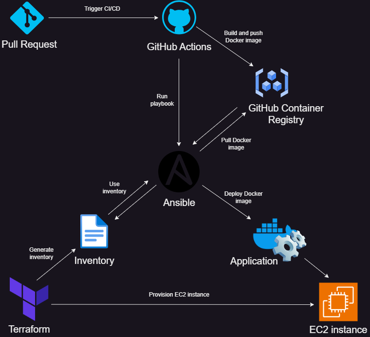

## DevOps Automation Project

This project demonstrates a robust and automated CI/CD pipeline for deploying a containerized application to an AWS EC2 instance using GitHub Actions, Terraform, and Ansible. The workflow ensures seamless integration of infrastructure provisioning, configuration management, and application deployment.

## Architecture Diagram

